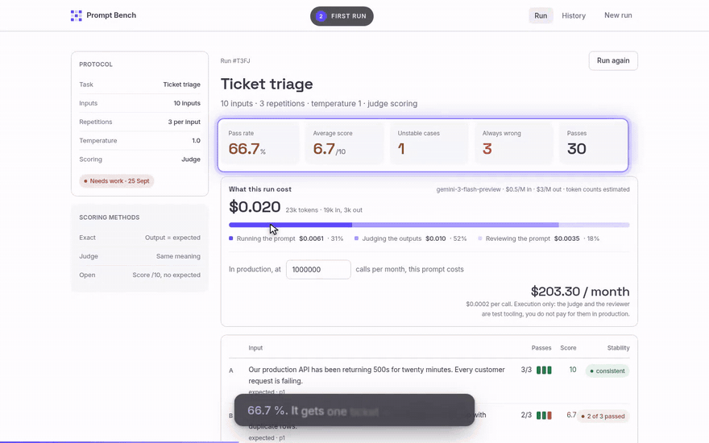
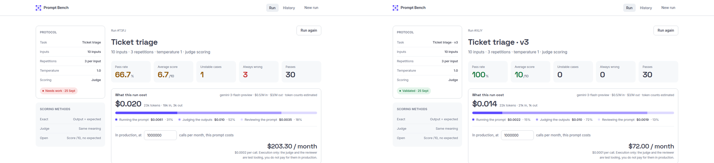
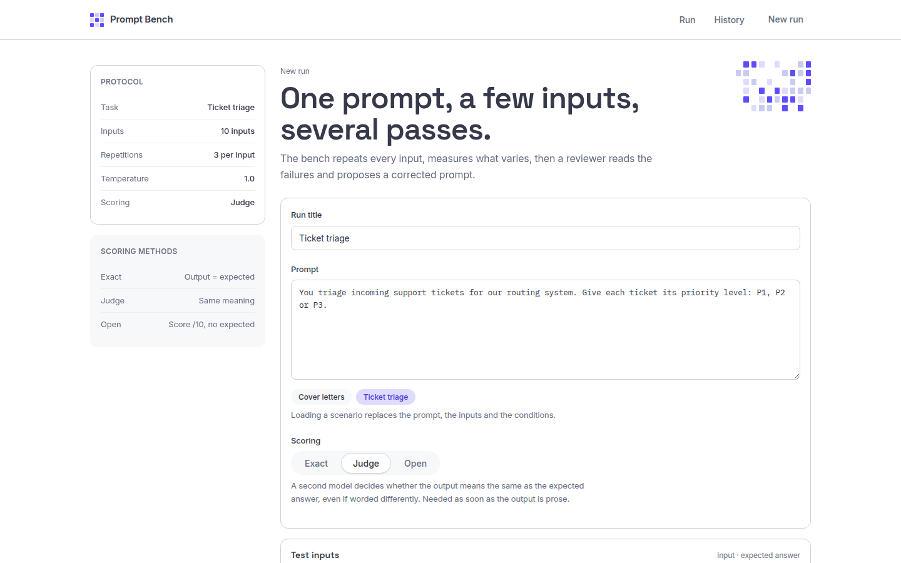
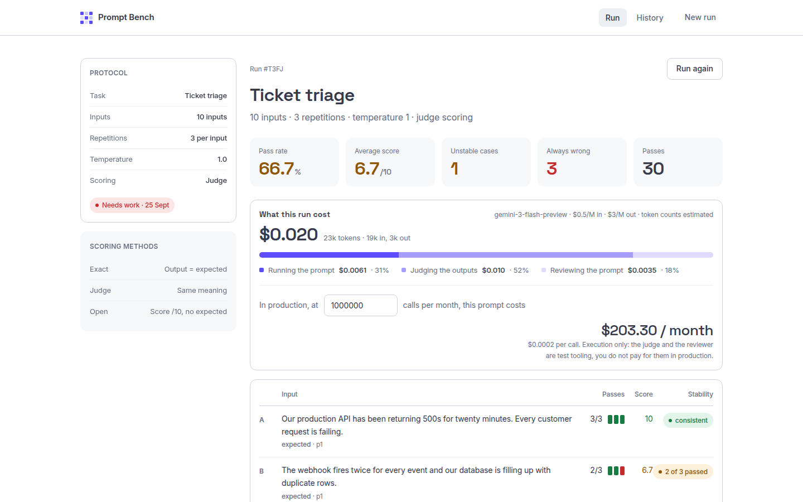
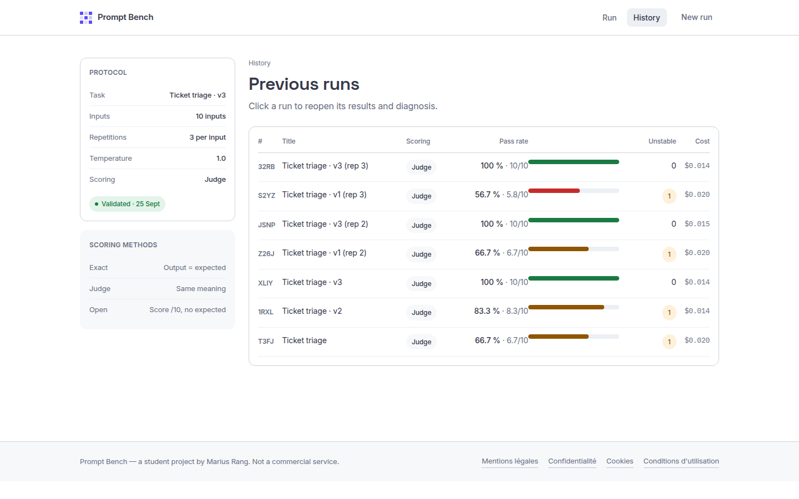
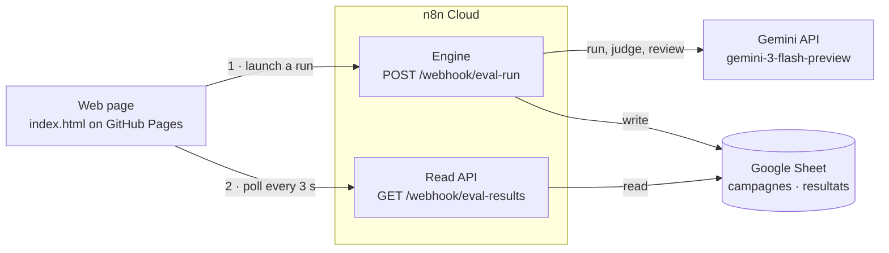

# Prompt Bench

**How reliable is your prompt, and what does it really cost?**

Prompt Bench runs one prompt over a test set, repeats every input several times, and measures what varies. A second model scores every answer. A third model reads the failures, explains what went wrong and rewrites the prompt. Each run also shows what it cost in tokens and dollars, and what the prompt would cost in production.

It runs on two n8n workflows and a Google Sheet, with a single HTML page as the interface.

**[Open the live app →](https://mariusrang.github.io/banc-essai-prompts/)**


## Demo (3 min, English subtitles)

[](docs/demo.mp4)

If the player does not show up, [download the video](docs/demo.mp4).

---

## Why

A prompt that works the three times you try it is not a prompt that works every time. Language models are not deterministic: at temperature 1, the same input can get a different answer on every call. Most prompts are tested by hand a few times, then shipped.

Cost is the other blind spot. Output tokens cost about six times more than input tokens, so a prompt that lets the model explain itself can cost several times more than it needs to. At one call that doesn't matter. At a million calls a month, it does.

Prompt Bench measures both before the prompt goes into production.

## What it does

1. **Run.** You write a prompt, add test inputs with their expected answers, and choose how many times each input is repeated and at what temperature. The bench shows an estimate of calls, tokens and cost before you start.
2. **Score.** Every output is scored in one of three ways:
   | Mode | Use it when | How it works |
   |---|---|---|
   | **Exact** | the answer is a label (a category, a yes/no) | The output must equal the expected answer after lowercasing and trimming final punctuation. Free and instant. |
   | **Judge** | the answer can be worded in different ways | A second model decides whether the output means the same as the expected answer, and gives a score out of 10. |
   | **Open** | there is no single right answer | The judge scores the output out of 10 against the instructions. |
3. **Measure.** For each input you get the pass rate over its repetitions, whether it is stable (always the same answer) or unstable, the distinct outputs it produced, and the judge's reasoning.
4. **Review.** A reviewer model reads every failed call and returns a diagnosis, the list of problems, a corrected prompt and what changed and why. It knows the average input and output tokens per call, so it also looks for ways to spend less. When nothing needs to change, it says so.
5. **Iterate.** *Apply and run again* reruns the same test with the corrected prompt. Every run is kept in the history, so versions can be compared.

## Case study: ticket triage

The task: give each incoming support ticket a priority level, P1, P2 or P3. Ten real-looking tickets, each with the priority a support team would give it. Every ticket runs three times at temperature 1, scored in Judge mode.

The first prompt is the one most people would write:

> You triage incoming support tickets for our routing system. Give each ticket its priority level: P1, P2 or P3.

| Version | Pass rate | Cost of the test run | Production cost per call | At 1 M tickets / month |
|---|---:|---:|---:|---:|
| First prompt | **66.7 %** | $0.0199 | $0.000203 | **$203** |
| v2 (reviewer's first fix) | 83.3 % | $0.0144 | $0.000059 | $59 |
| v3 (reviewer's second fix) | **100 %** | $0.0145 | $0.000072 | **$72** |

What the reviewer found:

- **The model didn't know the team's rules.** It labelled a slow export and a wrong invoice P3; the team calls those P2. The reviewer inferred a priority rubric from the expected answers, which nobody had written down, and added it to the prompt.
- **The model explained every answer.** About 60 output tokens of reasoning per ticket, for a two-character answer. The reviewer asked for the level alone.
- **One rule was still missing after v2.** Duplicate rows in the database were rated P2; for this team any data corruption is P1. The second fix added it. Asked again after v3, the reviewer answered that no change was needed.

The final prompt is three times longer, yet each test run costs 27 % less and each production call 64 % less, because the output went from a paragraph to two characters.

**Checked, not a lucky run.** Both prompts were run three times: the first prompt scored 66.7 %, 66.7 % and 56.7 %; the final prompt scored 100 % all three times.



<details>
<summary>More screenshots</summary>

**New run:** prompt, test inputs, scoring mode, conditions and the cost estimate.


**Results of the first prompt:** pass rate, stability, cost breakdown and monthly projection.


**History:** every version, with its pass rate and cost.


</details>

## Architecture



**Engine** (`n8n/engine.json`, 21 nodes)

1. A webhook receives the run. The request is validated and the run is recorded in the Sheet as *in progress*. The app gets a run id back straight away.
2. The test plan is split into one item per call (inputs × repetitions). Each call goes to Gemini, and the output and token counts are normalised.
3. Depending on the mode, each output goes either to an exact comparison in code or to a second Gemini call acting as judge, which returns a JSON verdict.
4. Results are aggregated per input: passes, stability, distinct outputs, scores, tokens and cost. The detail is written to the `resultats` tab.
5. A third Gemini call, the reviewer, reads the failures and returns a diagnosis, the problems, a corrected prompt and the changes. The run is updated in the `campagnes` tab with its scores, cost breakdown and analysis.

**Read API** (`n8n/read-api.json`, 7 nodes)

A GET webhook with two uses. Without a parameter, it returns the list of runs for the history screen. With `campagneId`, it returns one run with its per-input statistics and every call. It answers with one of three types (`introuvable`, `en cours`, `campagne`), so the page knows whether to keep polling.

**Front end** (`index.html`)

A single HTML file with no build step and no framework. It composes the run, polls the read API, and renders the results, the review, the cost card and the history. It works on phones.

## How the cost is calculated

- **Pricing:** gemini-3-flash-preview at $0.50 per million input tokens and $3.00 per million output tokens (Google AI for Developers pricing page, September 2026). The price is saved with each run, so old runs keep the price that applied when they ran.
- **Token counts are estimated** from character counts rather than read from the API: 4.3 characters per token for text sent, 5.5 for generated prose and 4.1 for JSON, plus the fixed size of the judge's and reviewer's instructions. The ratios were calibrated on one run and checked on another, where the estimate came within 0.8 % of the real token count and 0.7 % of the real cost.
- **The cost of a run** includes all three models: running the prompt, judging the outputs and the review.
- **The production cost** only counts running the prompt. The judge and the reviewer are testing tools; you don't pay for them once the prompt is live. The monthly projection multiplies that cost per call by the volume you type in (1,000,000 by default).

## Limits

- **The judge is a model too.** Judge and Open modes are only as good as the judge. Exact mode has no such bias, so use it whenever the answer is a label.
- **A small test set gives a noisy score.** With 10 inputs × 3 repetitions, a few points of difference can be chance. In one test, a corrected cover-letter prompt scored 94.4 % on its first run. Rerun three times, it averaged 88.9 % against 87.8 % for the original, and the two could not be told apart (p = 0.82). Rerun a version before trusting a small gain.
- **Costs are estimates** (see above), accurate to about 1 % on the runs they were checked on.
- **One model.** Every step uses gemini-3-flash-preview. Comparing models is not supported yet.

## Run your own

1. **Google Sheet.** Create a spreadsheet with two tabs:
   - `campagnes`: `Campagne ID`, `Date`, `Nom`, `Prompt`, `Mode`, `Temperature`, `Repetitions`, `Nb cas`, `Nb appels`, `Statut`, `Taux reussite`, `Cas instables`, `Latence moyenne`, `Score moyen`, `Diagnostic`, `Prompt corrige`, `Analyse`, `Tokens entree`, `Tokens sortie`, `Cout USD`, `Cout detail`
   - `resultats`: `Campagne ID`, `Cas ID`, `Entree`, `Attendu`, `Repetition`, `Sortie`, `Reussi`, `Score`, `Justification`, `Erreur`, `Tokens entree`, `Tokens sortie`
2. **n8n.** Import `n8n/engine.json` and `n8n/read-api.json` (*Workflows → Import from file*). In every Google Sheets node, select your spreadsheet in place of `YOUR_GOOGLE_SHEET_ID`, and add your Google Sheets credential. In the three Gemini nodes, add your Google Gemini (PaLM) API credential. Publish both workflows.
3. **Front end.** In `index.html`, set `const API` to your instance's webhook base URL (`https://<your-instance>.app.n8n.cloud/webhook`).
4. **Hosting.** Push the repository and turn on GitHub Pages (*Settings → Pages → Deploy from a branch → main / root*).

## Repository

```
index.html               the app
mentions-legales.html    legal notice
confidentialite.html     privacy policy
cookies.html             cookie policy
conditions.html          terms of use
legal.css                styles for the legal pages
fonts/                   self-hosted fonts (no request to Google Fonts)
llms.txt                 site summary for language models
n8n/engine.json          evaluation engine workflow
n8n/read-api.json        read API workflow
docs/                    demo video, GIF and screenshots
```

## Privacy

The site sets no cookies and stores nothing in the browser, so it needs no consent banner. Fonts are self-hosted, so opening the page sends nothing to Google. What you submit in a run (prompt, test inputs) is sent to the n8n engine and to Google's Gemini API, and is stored in the Google Sheet. The page says so next to the *Run* button, and the privacy policy gives the details. The legal pages are in French, as the publisher is based in France.

## Author

Marius Rang, CentraleSupélec × ESSEC. Built as the final project of an n8n course.
