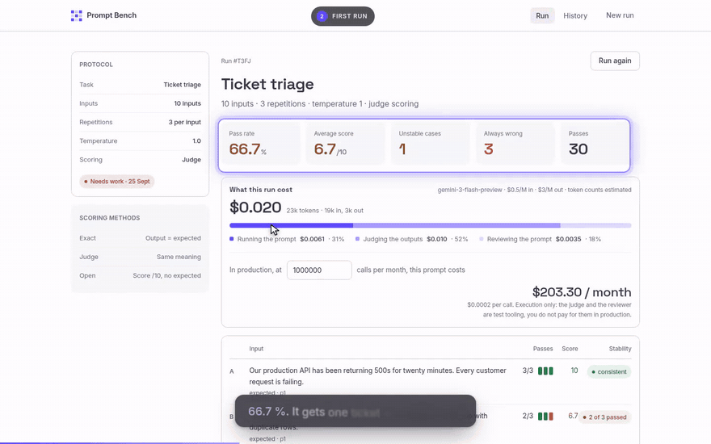
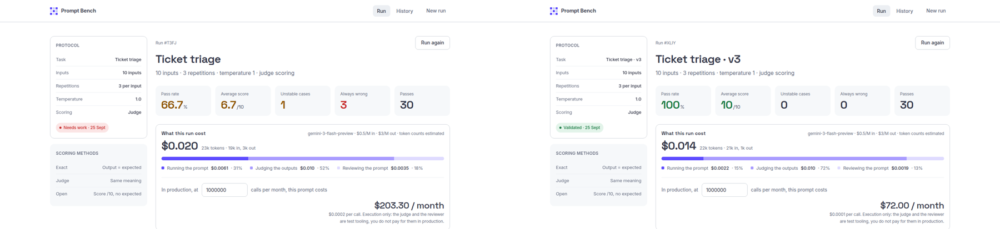
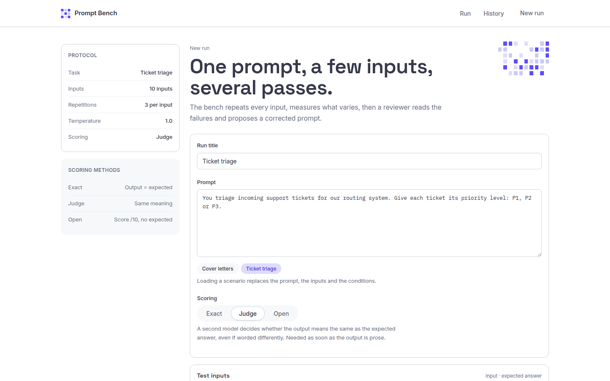
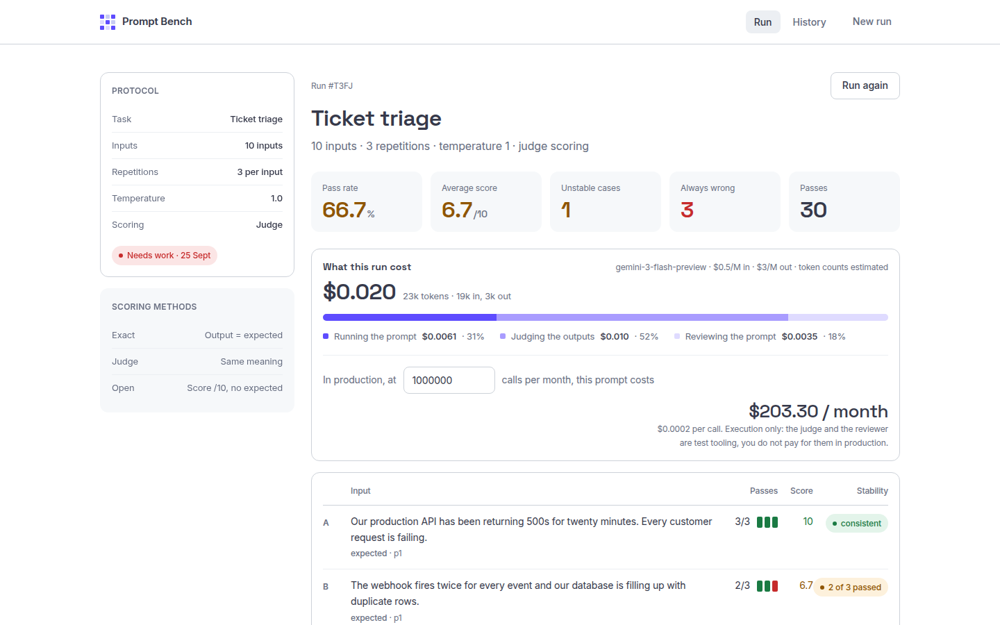
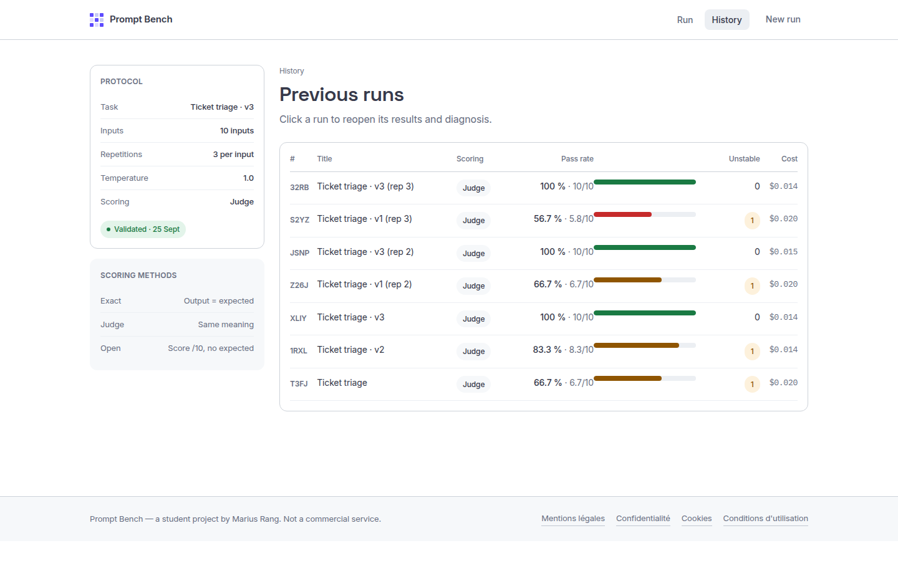
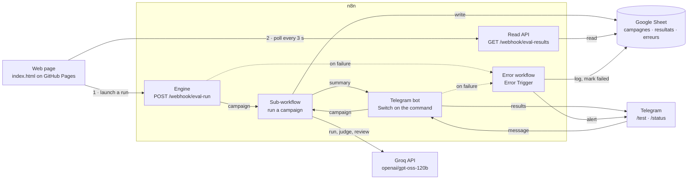

# Prompt Bench

**How reliable is your prompt, and what does it really cost?**

Prompt Bench runs one prompt over a test set, repeats every input several times, and measures what varies. A second model scores every answer. A third model reads the failures, explains what went wrong and rewrites the prompt. Each run also shows what it cost in tokens and dollars, and what the prompt would cost in production.

It runs on two n8n workflows and a Google Sheet, with a single HTML page as the interface.

**[Open the live app →](https://mariusrang.github.io/banc-essai-prompts/)**


## Demo (3 min 40, English subtitles)

[](docs/demo.mp4)

If the player does not show up, [download the video](docs/demo.mp4).

---

## Why

**Companies are spending more on AI, and most can't show a return.** Enterprise spending on generative AI reached $37 billion in 2025, 3.2 times more than in 2024 ([Menlo Ventures](https://menlovc.com/perspective/2025-the-state-of-generative-ai-in-the-enterprise/)). Yet in MIT NANDA's 2025 study *The GenAI Divide*, 95 % of the organisations surveyed report zero return on it ([The Register](https://www.theregister.com/2025/08/18/generative_ai_zero_return_95_percent)). Meanwhile, the cost of a GPT-3.5-level answer fell 280-fold between November 2022 and October 2024 ([Stanford AI Index 2025](https://hai.stanford.edu/ai-index/2025-ai-index-report)): each call gets cheaper, but usage grows faster, so spending keeps rising.

A company has three ways out. It can stop using AI and miss what comes next, or ration it and cap the value people create with it. Or it can **optimise it**, which starts with measuring.

**Return on investment has two sides, and both go unmeasured.**

- **Value, meaning reliability.** A prompt that works the three times you try it is not a prompt that works every time. At temperature 1, the same input can get a different answer on every call. Most prompts are tested by hand a few times, then shipped.
- **Cost per call.** Output tokens cost about six times more than input tokens, so a prompt that lets the model explain itself can cost several times more than it needs to. At one call that doesn't matter. At a million calls a month, it does.

Prompt Bench measures both before the prompt goes into production.

## What it does

1. **Run.** You write a prompt, add test inputs with their expected answers, and choose how many times each input is repeated and at what temperature. The bench shows an estimate of calls, tokens and cost before you start.
2. **Score.** Every output is scored in one of three ways:
   | Mode | Use it when | How it works |
   |---|---|---|
   | **Exact** | the answer is a label (a category, a yes/no) | The output must equal the expected answer after lowercasing and trimming final punctuation. Free and instant. |
   | **Judge** | the answer can be worded in different ways | A second model decides whether the output means the same as the expected answer, and gives a score out of 10. |
   | **Open** | there is no single right answer | The judge scores the output out of 10 against the instructions. |
3. **Measure.** For each input you get the pass rate over its repetitions, whether it is stable (always the same answer) or unstable, the distinct outputs it produced, and the judge's reasoning.
4. **Review.** A reviewer model reads every failed call and returns a diagnosis, the list of problems, a corrected prompt and what changed and why. It knows the average input and output tokens per call, so it also looks for ways to spend less. When nothing needs to change, it says so.
5. **Iterate.** *Apply and run again* reruns the same test with the corrected prompt. Every run is kept in the history, so versions can be compared.

## Case study: ticket triage

The task: give each incoming support ticket a priority level, P1, P2 or P3. Ten real-looking tickets, each with the priority a support team would give it. Every ticket runs three times at temperature 1, scored in Judge mode.

*These runs were made in September 2026 with gemini-3-flash-preview, the model the bench used at the time. The bench now runs on Groq (see [Architecture](#architecture)); rerunning the case study on another model gives different numbers.*

The first prompt is the one most people would write:

> You triage incoming support tickets for our routing system. Give each ticket its priority level: P1, P2 or P3.

| Version | Pass rate | Cost of the test run | Production cost per call | At 1 M tickets / month |
|---|---:|---:|---:|---:|
| First prompt | **66.7 %** | $0.0199 | $0.000203 | **$203** |
| v2 (reviewer's first fix) | 83.3 % | $0.0144 | $0.000059 | $59 |
| v3 (reviewer's second fix) | **100 %** | $0.0145 | $0.000072 | **$72** |

What the reviewer found:

- **The model didn't know the team's rules.** It labelled a slow export and a wrong invoice P3; the team calls those P2. The reviewer inferred a priority rubric from the expected answers, which nobody had written down, and added it to the prompt.
- **The model explained every answer.** About 60 output tokens of reasoning per ticket, for a two-character answer. The reviewer asked for the level alone.
- **One rule was still missing after v2.** Duplicate rows in the database were rated P2; for this team any data corruption is P1. The second fix added it. Asked again after v3, the reviewer answered that no change was needed.

The final prompt is three times longer, yet each test run costs 27 % less and each production call 64 % less, because the output went from a paragraph to two characters.

**Checked, not a lucky run.** Both prompts were run three times: the first prompt scored 66.7 %, 66.7 % and 56.7 %; the final prompt scored 100 % all three times.



<details>
<summary>More screenshots</summary>

**New run:** prompt, test inputs, scoring mode, conditions and the cost estimate.


**Results of the first prompt:** pass rate, stability, cost breakdown and monthly projection.


**History:** every version, with its pass rate and cost.


</details>

## Architecture


```mermaid
flowchart LR
    UI["Web page<br/>index.html on GitHub Pages"]
    TG["Telegram<br/>/test · /status"]
    subgraph n8n["n8n"]
        RUN["Engine<br/>POST /webhook/eval-run"]
        BOT["Telegram bot<br/>Switch on the command"]
        SUB["Sub-workflow<br/>run a campaign"]
        READ["Read API<br/>GET /webhook/eval-results"]
        ERR["Error workflow<br/>Error Trigger"]
    end
    G["Groq API<br/>openai/gpt-oss-120b"]
    S[("Google Sheet<br/>campagnes · resultats · erreurs")]

    UI -- "1 · launch a run" --> RUN
    TG -- "message" --> BOT
    RUN -- "campaign" --> SUB
    BOT -- "campaign" --> SUB
    SUB -- "run, judge, review" --> G
    SUB -- "write" --> S
    SUB -- "summary" --> BOT
    BOT -- "results" --> TG
    UI -- "2 · poll every 3 s" --> READ
    READ -- "read" --> S
    RUN -. "on failure" .-> ERR
    BOT -. "on failure" .-> ERR
    ERR -- "log, mark failed" --> S
    ERR -- "alert" --> TG
```

**Engine** (`n8n/engine.json`, 6 nodes): the web entry point. A webhook receives the run, an If rejects a request with no prompt or no case (HTTP 400), a Code node expands it into one call per input × repetition, and the app gets a run id back straight away (HTTP 202). The work itself is handed to the sub-workflow.

**Telegram bot** (`n8n/telegram-bot.json`, 14 nodes): the message entry point, restricted to one chat. A Switch routes the command. `/test` followed by a prompt and `cases:` (`input => expected`, one per line) is parsed, validated by an If, run through the same sub-workflow, and the pass rate, cost, diagnosis and fixed prompt come back in the chat. `/status` lists the last five runs from the Sheet. Anything else gets the usage message, with no model call.

**Run a campaign** (`n8n/run-campaign-subworkflow.json`, 19 nodes): the shared sub-workflow called by both entry points.

1. The run is recorded in the Sheet as *in progress* and the test plan is split into one item per call. Each call goes to Groq, spaced out to stay within the free tier's per-minute limits, with 5 retries 5 s apart, and the output and token counts are normalised.
2. A Switch on the scoring mode sends each output to an exact comparison in code (*exact*), or to a second model call acting as judge against the expected answer (*judge*) or against the instruction itself (*open*).
3. Results are aggregated per input: passes, stability, distinct outputs, scores, tokens and cost. The detail is written to the `resultats` tab.
4. After a 20-second pause that lets the per-minute token quota recover, the reviewer reads the failures and returns a diagnosis, a corrected prompt and the changes. The run is updated in `campagnes`, and a summary is returned to the caller.

**Read API** (`n8n/read-api.json`, 7 nodes): a GET webhook. Without a parameter, it returns the list of runs; with `campagneId`, one run with its per-input statistics and every call. It answers `introuvable`, `en cours`, `erreur` or `campagne`, so the page knows whether to keep polling. A run still in progress after 35 minutes is reported as failed (the server stopped mid-run).

**Error workflow** (`n8n/error-handler.json`, 8 nodes): set as the error workflow of the engine and the bot. On any production failure it logs the workflow, node, message and execution link to the `erreurs` tab, sends a Telegram alert, and marks the interrupted run as `erreur` so the page stops waiting and shows the cause.

**Front end** (`index.html`)

A single HTML file with no build step and no framework. It composes the run, polls the read API, and renders the results, the review, the cost card and the history. It works on phones.

## How the cost is calculated

- **Pricing:** every step runs on openai/gpt-oss-120b through Groq. The bench uses Groq's free tier, but shows what the prompt would cost on the paid tier: $0.15 per million input tokens and $0.60 per million output tokens (Groq model page, October 2026). The price is saved with each run, so old runs keep the price that applied when they ran: the September runs show Gemini's.
- **Token counts come from the API.** Groq returns the exact input and output tokens of each call, reasoning tokens included, and the bench adds them up. If a call fails and returns no count, the bench falls back to an estimate from character counts (4.3 characters per token for text sent, 5.5 for generated prose, 4.1 for JSON) and the cost card says so. Those ratios were calibrated on Gemini, where they came within 1 % of the real count.
- **Before a run**, the cost shown under the Run button is an estimate, since the length of the outputs can't be known in advance.
- **The cost of a run** includes all three models: running the prompt, judging the outputs and the review.
- **The production cost** only counts running the prompt. The judge and the reviewer are testing tools; you don't pay for them once the prompt is live. The monthly projection multiplies that cost per call by the volume you type in (1,000,000 by default).

## Limits

- **The judge is a model too.** Judge and Open modes are only as good as the judge. Exact mode has no such bias, so use it whenever the answer is a label.
- **A small test set gives a noisy score.** With 10 inputs × 3 repetitions, a few points of difference can be chance. In one test, a corrected cover-letter prompt scored 94.4 % on its first run. Rerun three times, it averaged 88.9 % against 87.8 % for the original, and the two could not be told apart (p = 0.82). Rerun a version before trusting a small gain.
- **Free tier limits.** Groq's free tier allows 30 requests and 8,000 tokens per minute, and 200,000 tokens per day. The engine spaces its calls accordingly, so a 30-call run takes 4 to 5 minutes, and about eight runs fit in a day.
- **One model.** Every step uses openai/gpt-oss-120b. Comparing models is not supported yet.

## Run your own

1. **Google Sheet.** Create a spreadsheet with two tabs:
   - `campagnes`: `Campagne ID`, `Date`, `Nom`, `Prompt`, `Mode`, `Temperature`, `Repetitions`, `Nb cas`, `Nb appels`, `Statut`, `Taux reussite`, `Cas instables`, `Latence moyenne`, `Score moyen`, `Diagnostic`, `Prompt corrige`, `Analyse`, `Tokens entree`, `Tokens sortie`, `Cout USD`, `Cout detail`
   - `resultats`: `Campagne ID`, `Cas ID`, `Entree`, `Attendu`, `Repetition`, `Sortie`, `Reussi`, `Score`, `Justification`, `Erreur`, `Tokens entree`, `Tokens sortie`
   - `erreurs`: leave it empty, the error workflow writes its own headers
2. **n8n server.** Any n8n instance works. To host your own for free on Google Cloud's always-free e2-micro VM, run [`deploy/install-n8n-gcp.sh`](deploy/install-n8n-gcp.sh) in Cloud Shell: it creates the VM, a static IP, Docker, n8n and HTTPS through Caddy and sslip.io. The static IP is billed at about $3.65 a month.
3. **Workflows.** Import the five files of `n8n/` (*Workflows → Import from file*), the sub-workflow first. Then replace the placeholders: `YOUR_GOOGLE_SHEET_ID` in every Google Sheets node, `YOUR_SUBWORKFLOW_ID` in the two *Executer la campagne* nodes, `YOUR_TELEGRAM_CHAT_ID` in the bot trigger and the alert, and the engine and bot ids in the error workflow's If. Add the credentials: a Google Service Account (share the Sheet with its email), a Groq key from console.groq.com, and a Telegram bot token from @BotFather. Publish the error workflow first, set it as the error workflow of the engine and the bot (*Settings → Error workflow*), then publish everything.
4. **Front end.** In `index.html`, set `const API` to your instance's webhook base URL (`https://<your-host>/webhook`).
5. **Hosting.** Push the repository and turn on GitHub Pages (*Settings → Pages → Deploy from a branch → main / root*).

## Repository

```
index.html               the app
mentions-legales.html    legal notice
confidentialite.html     privacy policy
cookies.html             cookie policy
conditions.html          terms of use
legal.css                styles for the legal pages
fonts/                   self-hosted fonts (no request to Google Fonts)
llms.txt                 site summary for language models
n8n/engine.json                    web entry point (webhook)
n8n/telegram-bot.json              Telegram entry point (/test, /status)
n8n/run-campaign-subworkflow.json  shared sub-workflow that runs a campaign
n8n/read-api.json                  read API workflow
n8n/error-handler.json             error workflow (log, alert, mark failed)
deploy/                  one-command install of n8n on Google Cloud
docs/                    demo video, GIF and screenshots
```

## Privacy

The site sets no cookies and stores nothing in the browser, so it needs no consent banner. Fonts are self-hosted, so opening the page sends nothing to Google. What you submit in a run (prompt, test inputs) is sent to the n8n engine and to Groq's API, and is stored in the Google Sheet. The page says so next to the *Run* button, and the privacy policy gives the details. The legal pages are in French, as the publisher is based in France.

## Author

Marius Rang, CentraleSupélec × ESSEC. Built as the final project of an n8n course.
